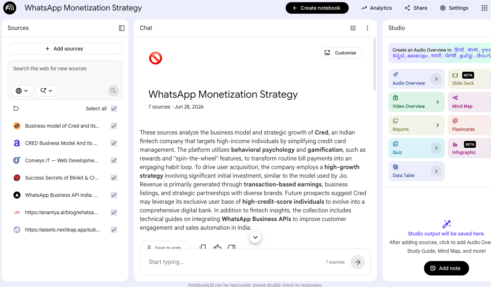
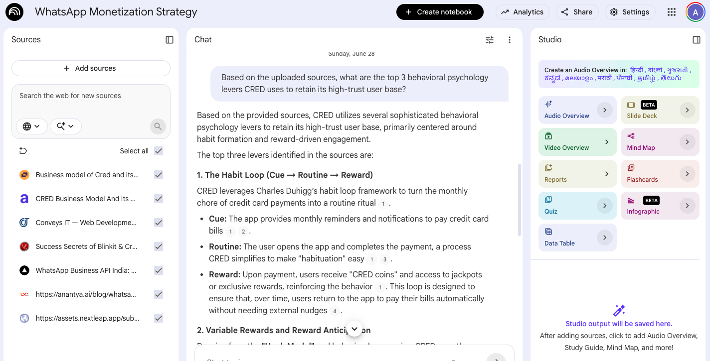
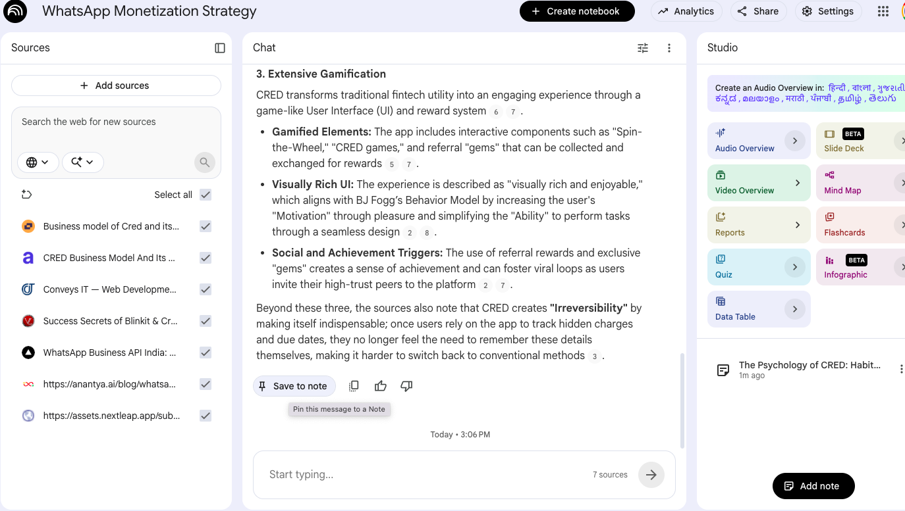
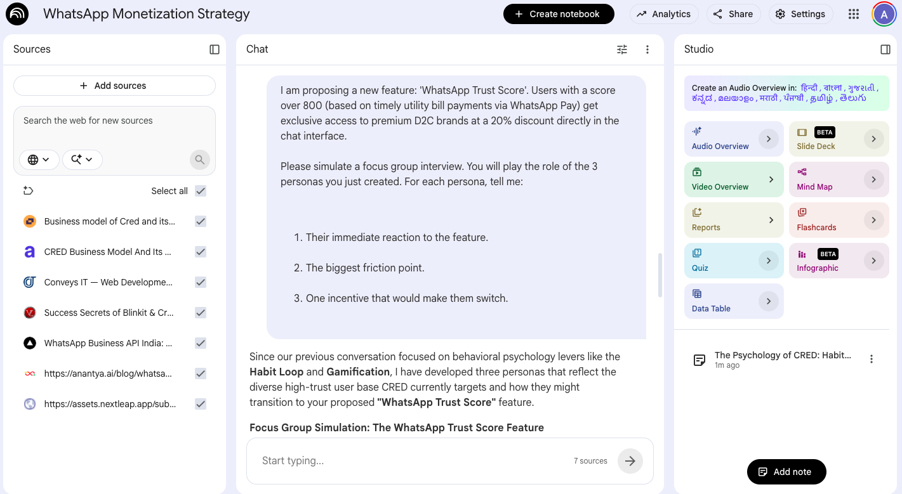
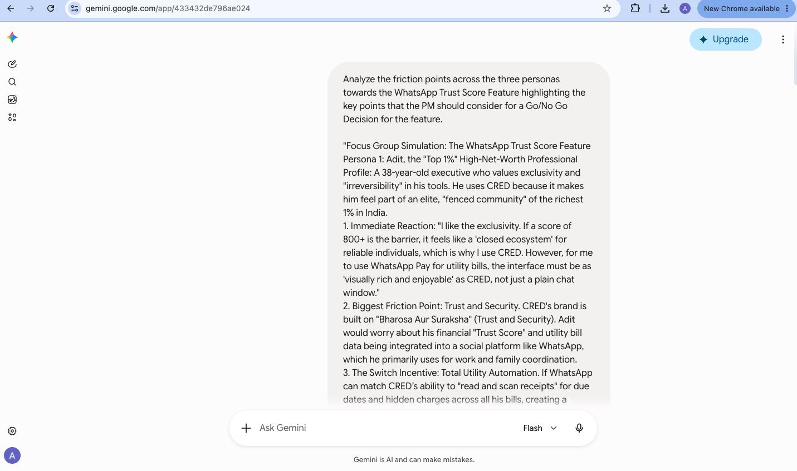
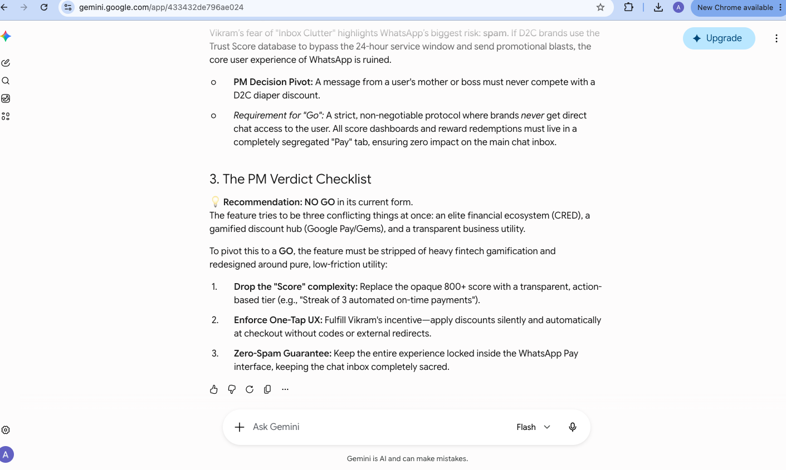

# WhatsApp x CRED Monetization — Market Synthesis to Go/No-Go, with NotebookLM & Gemini

> Workshop Module 1 — *Using GenAI and Agentic AI for Product & Corporate Strategy*

This repo is a practical, reusable playbook for **Product Managers** who want to go from a pile of unstructured market research to a defensible Go/No-Go product decision — in under an hour instead of 3–4 months — using **NotebookLM** and **Gemini** together.

It's built around a real workshop scenario: as a Strategy Manager at Meta India, you're exploring how to monetize WhatsApp's user base by borrowing CRED's "Trust Score" playbook to unlock premium commerce perks for high-value users. The repo walks through the complete flow end to end — not just the research step, but the persona work, the feature stress-test, and the final strategic synthesis that a PM would actually bring into a leadership review.

## Why this matters for PMs

The legacy version of this workflow looks like:

- Weeks spent reading dense, multi-page financial summaries and manually cataloging stats across disparate documents
- Static, self-reported user surveys with low behavioral fidelity
- Expensive focus groups that take months to recruit
- Excel models and manual synthesis, prone to confirmation bias
- **Result:** 3–4 months to reach a go/no-go decision

The GenAI-accelerated version replaces each of those steps with a fast, traceable equivalent — without skipping the actual thinking a PM needs to do.

## The complete flow

| # | Exercise | Tool | What it produces |
|---|---|---|---|
| 1 | [Market Synthesis](docs/market-synthesis-playbook.md) | NotebookLM | Behavioral insight into *why* CRED's model works, grounded in your uploaded sources |
| 2 | [Persona Generation](docs/persona-generation-playbook.md) | Gemini | 3 distinct, research-grounded target personas |
| 3 | [Feature Stress-Test](docs/feature-stress-test-playbook.md) | Gemini | A simulated focus group reacting to the actual proposed feature |
| 4 | [Strategic Synthesis & Go/No-Go](docs/strategic-synthesis-playbook.md) | Gemini | A friction matrix, the strategic tensions behind it, and a clear recommendation |

## What's in this repo

| Path | Purpose |
|---|---|
| [`docs/workshop-context.md`](docs/workshop-context.md) | The full role, scenario, and objectives for Workshop Module 1 |
| [`docs/market-synthesis-playbook.md`](docs/market-synthesis-playbook.md) | Exercise 1: setting up NotebookLM, sourcing material, running the research prompt |
| [`docs/persona-generation-playbook.md`](docs/persona-generation-playbook.md) | Exercise 2: turning research into 3 synthetic personas |
| [`docs/feature-stress-test-playbook.md`](docs/feature-stress-test-playbook.md) | Exercise 3: simulating a focus group against a concrete feature proposal |
| [`docs/strategic-synthesis-playbook.md`](docs/strategic-synthesis-playbook.md) | Exercise 4: turning friction points into a Go/No-Go decision |
| [`prompts/strategic-prompts.md`](prompts/strategic-prompts.md) | Every copy-paste-ready prompt from all 4 exercises, in order |
| [`reference-outputs/`](reference-outputs/) | Full worked examples — the actual personas, focus-group transcript, and final analysis generated in a live run, to compare your own output against |
| [`notes-template/synthesis-notes-template.md`](notes-template/synthesis-notes-template.md) | A template for capturing NotebookLM's pinned notes into a shareable one-pager |
| [`screenshots/`](screenshots/) | Real screenshots from a live walkthrough (see folder README for exact filenames needed) |

## Quick start

### Step 1 — Market research in NotebookLM

Open [NotebookLM](https://notebooklm.google.com/), create a notebook titled **"WhatsApp Monetization Strategy"**, upload 2–3 sources, and run the market research prompt.

### Step 2 — Persona generation in Gemini

In [Gemini](https://gemini.google.com/), paste your findings as context and generate 3 target personas.

### Step 3 — Feature stress-test in Gemini

Propose the "WhatsApp Trust Score" feature and simulate a focus group against those personas.

### Step 4 — Strategic synthesis in Gemini

Feed the transcript into a fresh Gemini prompt and get a friction matrix + Go/No-Go verdict.

*(See [`screenshots/README.md`](screenshots/README.md) for exactly what each screenshot should capture and the required filenames.)*

Full prompts for every step are in [`prompts/strategic-prompts.md`](prompts/strategic-prompts.md); full worked-example outputs are in [`reference-outputs/`](reference-outputs/).

## The bottom line

By the end of this flow, a PM has: a grounded research base, three defensible target personas, a simulated stress-test surfacing real friction points, and a synthesized recommendation — in this reference run, a **"No-Go in current form"** verdict with three specific, actionable conditions to flip it to a Go. That's a fundamentally stronger starting point for a leadership conversation than "the feature seems interesting."

Tools used: **NotebookLM, Gemini** · Duration: 45 minutes total

## License

MIT — reuse and adapt for your own team's workshops.
